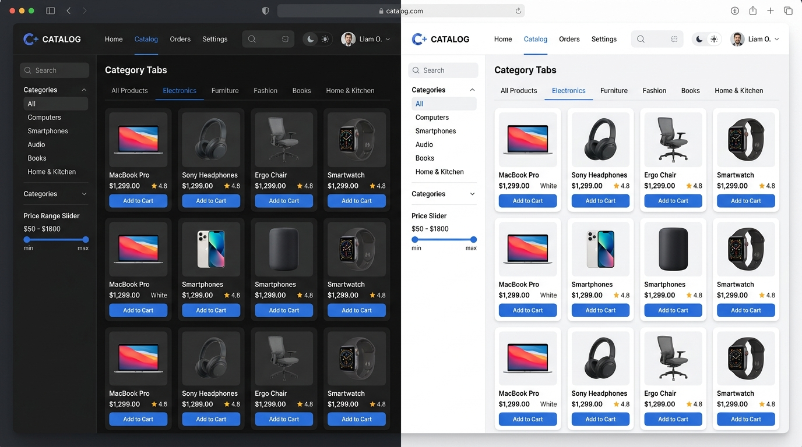

# ProCatalog - Product Catalog Single-Page Application (SPA)

> **Frontend Second Semester Examination Project**  
> *Built with React 19, TypeScript, Tailwind CSS, Lucide Icons, and WCAG 2.1 AA Accessibility Standards.*



---

## 🌟 Executive Summary

**ProCatalog** is a high-performance, responsive Single-Page Application (SPA) built for managing and showcasing a diverse catalog of 50 products. It provides a modern user interface supporting real-time search, dynamic category filtering, price range adjustments, sorting, view toggling (Grid vs. List), full CRUD product management with form validation, and robust runtime Error Boundary recovery.

---

## 🚀 Key Features Matrix

### 📦 1. Product Catalog & List Rendering
- **50 Mock Products**: Pre-loaded mock dataset spanning 6 categories: *Electronics*, *Fashion*, *Home & Living*, *Books & Stationery*, *Sports & Fitness*, and *Beauty & Wellness*.
- **Grid & List Views**: Instant toggle between responsive multi-column grid view and detailed list row view.
- **Stock & Rating Badges**: Visual indicators for stock levels (*Out of Stock*, *Low Stock*, *In Stock*) and customer star ratings.
- **Pagination**: Configurable page sizes (8, 12, 24, 48 items per page) with item counters (`Showing 1 to 12 of 50 products`).

### 🔍 2. Real-Time Search & Filtering
- **Debounced Search**: Instant filtering by product title, description, or category.
- **Category Filter Tabs**: Interactive pills displaying total item counts per category.
- **Price Range Slider**: Filter catalog items dynamically up to $500.
- **Stock Filter Toggle**: Quickly isolate products currently in stock.
- **Sorting Engine**: Sort products by *Featured First*, *Price (Low to High / High to Low)*, *Customer Rating*, *Title (A-Z)*, or *Newest Added*.
- **Mobile Filter Drawer**: Responsive touch-friendly filter sidebar for mobile viewports.

### 📝 3. Product Management & Form Validation
- **Add & Edit Modal**: Slide-over modal dialog for creating new products or updating existing items.
- **Strict Client-Side Validation**:
  - `Title`: Required, min 3 characters, max 100 characters.
  - `Description`: Required, min 10 characters.
  - `Price`: Required, numeric, must be a positive number (> $0).
  - `Category`: Required selection.
  - `Image URL`: Valid http/https URL with quick sample image presets selector.
  - `Stock`: Non-negative numeric value.
- **Interactive Feedback**: Touch/Blur validation states, live error text below input fields, `aria-invalid` tags, and live thumbnail image preview.
- **Confetti Celebration**: Celebratory particle animation on successfully adding a new product.

### 🛡️ 4. Resilience & Error Handling
- **React Error Boundary**: Catch runtime JavaScript rendering errors gracefully without crashing the whole application.
- **Fallback UI Screen**: Informative exception display with *"Try Again"* and *"Reset App State & Reload"* recovery options.
- **Live Demo Trigger**: Integrated button in footer to test the Error Boundary fallback UI live.

### ♿ 5. WCAG 2.1 AA Accessibility & UI/UX
- **Semantic HTML5**: Native `<header>`, `<nav>`, `<main>`, `<section>`, `<article>`, `<aside>`, and `<footer>` tags.
- **ARIA Compliance**: `aria-label`, `aria-expanded`, `aria-controls`, `aria-live="polite"`, `role="dialog"`, `role="alert"`.
- **Keyboard Navigation**: Full tab index order, `Escape` key close handlers for all modals, and focus trap.
- **Accessible Skip Link**: Screen reader and keyboard skip-to-main-content link.
- **Dark / Light Theme Toggle**: Persistent theme state with WCAG AA compliant contrast ratios.

---

## 🛠️ Technology Stack & Architecture

| Layer | Technology | Rationale |
| :--- | :--- | :--- |
| **Core Framework** | React 19 | Functional components with modern hooks (`useMemo`, `useEffect`, `useContext`) |
| **Language** | TypeScript ~5.7 | Strict static typing for products, filters, forms, and toast notifications |
| **Build Tooling** | Vite 6 | Lightning-fast HMR and optimized production bundling |
| **Styling** | Tailwind CSS v3 | Utility-first CSS with dark mode support and custom design tokens |
| **Icons** | Lucide React | Clean, consistent SVG icon set for actions and status badges |
| **State Persistence**| LocalStorage API | Automatically persists added/updated products and theme settings |

---

## 📂 Project Directory Structure

```
product-catalog-spa/
├── public/
│   ├── catalog_dashboard.jpg   # Preview screenshot
│   └── favicon.svg             # Application icon
├── src/
│   ├── components/
│   │   ├── catalog/
│   │   │   ├── EmptyState.tsx        # Zero filter results view
│   │   │   ├── Pagination.tsx        # Page navigation & per-page selector
│   │   │   ├── ProductCard.tsx       # Grid & List view card rendering
│   │   │   ├── ProductDetailModal.tsx # Quick view detail dialog
│   │   │   ├── ProductFilter.tsx     # Search, filter, sort & drawer
│   │   │   ├── ProductGrid.tsx       # Catalog grid wrapper
│   │   │   └── SkeletonLoader.tsx    # Loading state skeleton UI
│   │   ├── common/
│   │   │   ├── ConfirmDialog.tsx     # Accessible delete confirmation modal
│   │   │   ├── Footer.tsx            # Semantic footer with WCAG badge
│   │   │   ├── Header.tsx            # Navigation, logo, & quick actions
│   │   │   └── Toast.tsx             # Toast notification alerts
│   │   ├── error/
│   │   │   └── ErrorBoundary.tsx     # React Error Boundary class component
│   │   └── form/
│   │       └── ProductFormModal.tsx  # Product Add/Edit form with validation
│   ├── context/
│   │   └── ProductContext.tsx        # State manager & LocalStorage sync
│   ├── data/
│   │   └── mockProducts.ts           # 50 AI-generated mock products dataset
│   ├── types/
│   │   └── product.ts                # TypeScript interfaces & types
│   ├── utils/
│   │   └── formatters.ts             # Currency ($ USD), date & string helpers
│   ├── App.tsx                       # App entry container & error boundary
│   ├── index.css                     # Tailwind CSS directives & scrollbar styling
│   └── main.tsx                      # DOM root mount
├── package.json
├── index.html
├── tailwind.config.js
├── vite.config.ts
└── README.md                         # Comprehensive documentation
```

---

## ⚙️ Installation & Setup Instructions

### Prerequisites
- **Node.js**: v18.0.0 or higher
- **npm**: v9.0.0 or higher

### Local Development Setup

1. **Clone the repository**:
   ```bash
   git clone https://github.com/your-username/product-catalog-spa.git
   cd product-catalog-spa
   ```

2. **Install dependencies**:
   ```bash
   npm install
   ```

3. **Start the development server**:
   ```bash
   npm run dev
   ```
   *Access the app at `http://localhost:3000` in your web browser.*

4. **Build for Production**:
   ```bash
   npm run build
   ```

5. **Preview Production Build**:
   ```bash
   npm run preview
   ```

---

## 📊 Mock API & Product Schema Documentation

The catalog mock dataset is defined in [`src/data/mockProducts.ts`](src/data/mockProducts.ts).

### Product Interface Schema

```typescript
export interface Product {
  id: string;             // Unique identifier (e.g. "prod-001")
  title: string;          // Product title (min 3 chars)
  description: string;    // Product overview (min 10 chars)
  price: number;          // Price in USD (> 0)
  category: CategoryType; // 'Electronics' | 'Fashion' | 'Home & Living' | 'Books & Stationery' | 'Sports & Fitness' | 'Beauty & Wellness'
  imageUrl: string;       // Unsplash image URL
  rating: number;         // Average star rating (1.0 - 5.0)
  reviewCount: number;    // Number of reviews
  stock: number;          // Inventory stock level
  isFeatured?: boolean;   // Optional featured status
  createdAt: string;      // ISO 8601 creation timestamp
}
```

---

## 🚢 Deployment Instructions

### Deploy to Vercel
1. Push your code to your GitHub repository.
2. Import the repository into your Vercel Dashboard.
3. Framework Preset: **Vite**.
4. Build Command: `npm run build`.
5. Output Directory: `dist`.
6. Click **Deploy**.

### Deploy to Netlify
1. Log into your Netlify account and click **Add new site** -> **Import an existing project**.
2. Connect your GitHub repository.
3. Build Command: `npm run build`.
4. Publish directory: `dist`.
5. Click **Deploy Site**.

---

## 🐛 Known Limitations & Future Roadmap

### Known Limitations
- LocalStorage storage limit (~5MB) applies to custom added products.
- Image URLs rely on external network connectivity (Unsplash CDN). Automatic fallback images are supplied if an image fails to load.

### Planned Future Enhancements
- [ ] Connect to backend REST / GraphQL API or Firebase Firestore.
- [ ] Multi-currency selector ($ USD, € EUR, £ GBP, ₦ NGN).
- [ ] Export product catalog to CSV / JSON files.
- [ ] Drag-and-drop image file upload integration.

---

## 👤 Submission & Repository Information

- **Collaborator Added**: `@Oluwasetemi`
- **License**: MIT
- **Project Type**: Frontend Second Semester Examination Project
